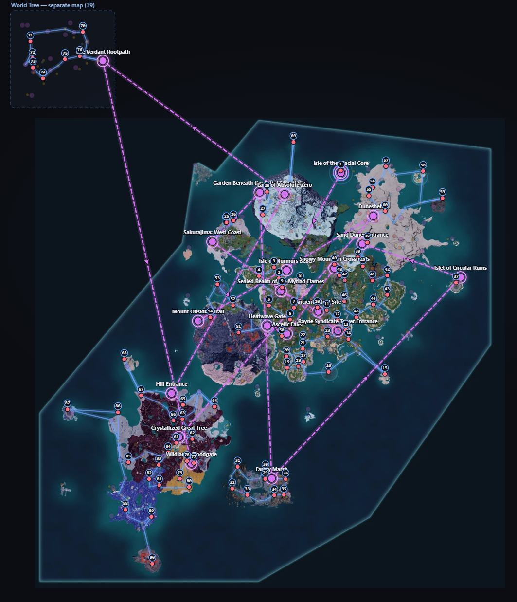
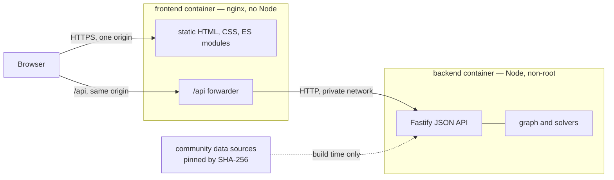

# PalRoute

Route planner for **Palworld**. Fast-travel beacons are real edges in the graph, so *"walk 800 m"* and *"teleport, then walk 200 m"* compete on the same units — **seconds**.

Three questions, one map of 652 points of interest and 152 beacons:

- **Nearest** — what can I reach quickly, and **which beacon serves each target**? One multi-source pass answers it for every POI at once.
- **Route** — the fastest path to one place, leg by leg, naming the beacon to start from.
- **Tour** — the shortest order to visit *everything* matching a filter. All 153 Lifmunk effigies solve in about a second.



Unofficial fan tool. Not affiliated with or endorsed by Pocketpair.

## Two services, deployed separately



**The browser only ever talks to the frontend's origin.** `/api` is forwarded server-side — by nginx in the shipped image, by the dev server locally, by an edge rewrite on Vercel. The API's real address never reaches the browser, so it can be firewalled to the frontend alone, and no CORS is involved.

| | [`backend/`](backend) | [`frontend/`](frontend) |
|---|---|---|
| **What** | JSON API **and** a CLI over the same engine | The map UI |
| **Stack** | Node ≥20.11, TypeScript, Fastify | HTML, CSS, ES modules — no build step, no framework, no runtime |
| **Ships as** | `node:22-alpine` image, non-root | `nginx:alpine` image with no Node in it |
| **Owns** | dataset, graph, routing | rendering, filtering, interaction |

They share nothing but an HTTP contract. There is deliberately no compose file: the frontend can sit on Vercel while the API runs on a box somewhere else.

## Quick start

Two terminals. The API first — the dataset is **not** committed, so the fetch steps are required, not optional:

```bash
npm --prefix backend install
npm --prefix backend run data:fetch    # community sources (~240 KB), network once
npm --prefix backend run data:build    # normalize into data/pois.json — 652 POIs
npm --prefix backend run serve         # http://127.0.0.1:6969
```

Then the UI:

```bash
npm --prefix frontend run dev          # http://127.0.0.1:6767
```

Open **http://127.0.0.1:6767** — not 6969. The dev server proxies `/api`, so the browser stays on one origin.

Full instructions, Docker, TLS and deployment: [backend README](backend/README.md) · [frontend README](frontend/README.md).

## What is actually going on inside

The design rationale lives in [**PALROUTE_SPEC.md**](backend/Docs/PALROUTE_SPEC.md). The parts worth knowing up front:

**Everything is seconds, not metres.** That single decision is what makes teleporting and walking comparable at all. Beacons form a clique restricted to the beacons *you* have unlocked, so the graph changes with the player rather than assuming a finished game.

**One Dijkstra, not N.** Multi-source with an implicit super-source: every unlocked beacon is seeded at its entry cost, and an `origin` array propagates on relaxation. One pass yields both the travel time *and* the serving beacon for all 652 POIs.

**2-opt that survives asymmetry.** Portal edges make `d(i, j) ≠ d(j, i)`, which invalidates the usual two-boundary-edge delta, so each candidate reversal is recosted in full. Slower per candidate, correct on this graph.

**The world→map transform is fitted, never hardcoded.** Least squares over published calibration points, and the validator reports that only 2 correspondences exist — enough to fit, not enough to hold out. It says so instead of implying the fit generalises.

**The dataset is pinned, not vendored.** The upstream publishes no licence, so no coordinates are committed here; `data/sources.lock.json` pins every input by SHA-256 and the Docker build verifies against it with `--frozen`. When three of six sources silently changed under a stale lockfile, that is exactly what caught it.

**Gaps are declared, not hidden.** Six POI kinds are empty — tower bosses, chests, ore nodes and others — each with a recorded reason. Terrain is **Tier B**: distances are straight lines with a Z penalty, so real on-foot times are longer, and every response carries a banner saying so. Absolute numbers are indicative; relative comparisons are sound.

**79 tests** cover the acceptance criteria in the spec: teleport-versus-walk fixtures, layer isolation, 2-opt monotonicity, unreachability reporting, CLI exit codes, cache eviction, and the API contract.

```bash
npm --prefix backend test
```

## Layout

```
backend/          JSON API + CLI. Node, TypeScript, Fastify
  src/            data · graph · solve · render · api
  test/           79 tests
  data/           lockfile, profiles, expectations — no coordinates
  Docs/           PALROUTE_SPEC.md
frontend/         The UI. No build step
  pages/ css/ scripts/
  data/           base map image
  nginx.conf      production routing and cache headers
  server.js       DEV ONLY static server + /api proxy
assets/           README screenshot
```

## Credits

PalRoute computes routes; it does not extract game data. Coordinates come from [oMaN-Rod/palworld-save-pal](https://github.com/oMaN-Rod/palworld-save-pal) and the coordinate system from [palworldlol/palworld-coord](https://github.com/palworldlol/palworld-coord) — full table and licence notes in the [backend Credits](backend/README.md#credits).

The base map image bundled in `frontend/data/` is community-made fan art, not this project's work and **not covered by the MIT licence**, which applies to PalRoute's own source only. Details in the [frontend Credits](frontend/README.md#credits) and [LICENSE](LICENSE).

Palworld and all related assets are the property of Pocketpair.
